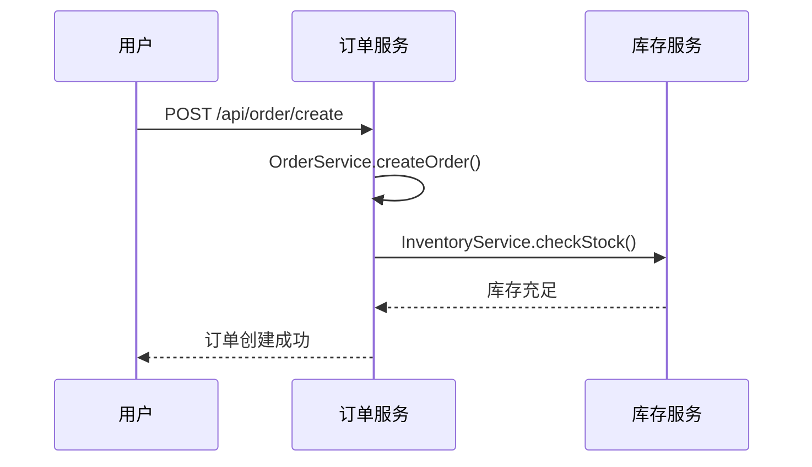
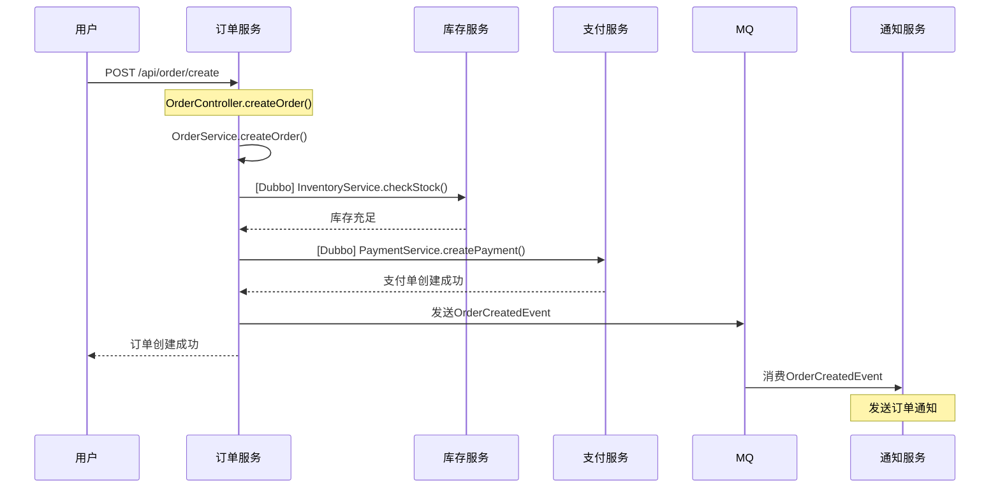

# 业务链路生成技术方案

## 1. 整体架构

```
多个Git仓库
    ↓
代码扫描 (ProjectScanner)
    ↓
服务依赖分析 (ServiceDependencyAnalyzer)
    ↓
调用链路追踪 (BusinessFlowTracer)
    ↓
AI语义理解 (Claude/Codex)
    ↓
Mermaid时序图生成 (MermaidGenerator)
    ↓
前端展示 (Vue + Mermaid.js)
```

---

## 2. 核心组件设计

### 2.1 ServiceDependencyAnalyzer（服务依赖分析器）

**职责**：识别服务间的调用关系

**输入**：多个仓库的 `ProjectStructure`

**输出**：`ServiceDependencyGraph`（服务依赖图）

**关键逻辑**：
```java
// 识别Dubbo调用
@Reference / @DubboReference → 记录依赖的接口

// 识别Feign调用
@FeignClient(name="order-service") → 记录依赖的服务

// 识别RestTemplate调用
restTemplate.getForObject("http://order-service/api/...") → 解析URL

// 匹配接口与实现
Dubbo接口 → 查找 @DubboService 实现类
```

---

### 2.2 BusinessFlowTracer（业务链路追踪器）

**职责**：从入口点开始，递归追踪调用链路

**输入**：
- 入口点（HTTP/Dubbo/MQ等）
- 服务依赖图

**输出**：`BusinessFlow`（业务流程对象）

**追踪算法**：
```
1. 从入口点开始（如：POST /api/order/create）
2. 分析方法内的调用：
   - 本地方法调用 → 继续追踪
   - Dubbo/Feign调用 → 跨服务追踪
   - MQ发送 → 记录异步调用
3. 递归深度限制：最多5层
4. 循环检测：避免死循环
5. 构建调用树
```

---

### 2.3 MermaidGenerator（Mermaid生成器）

**职责**：将业务流程转换为Mermaid时序图

**输入**：`BusinessFlow`

**输出**：Mermaid DSL字符串

**生成规则**：


---

## 3. 数据模型

### 3.1 ServiceDependency（服务依赖）

```java
@Data
public class ServiceDependency {
    private String sourceService;      // 调用方服务
    private String targetService;      // 被调用方服务
    private String interfaceName;      // 接口全限定名
    private DependencyType type;       // DUBBO/FEIGN/HTTP/MQ
    private String sourceClass;        // 调用方类
    private String sourceMethod;       // 调用方法
}
```

### 3.2 ServiceDependencyGraph（服务依赖图）

```java
@Data
public class ServiceDependencyGraph {
    private Map<String, ServiceNode> services;           // 服务节点
    private List<ServiceDependency> dependencies;        // 依赖关系

    // 查询方法
    public List<ServiceDependency> findDependencies(String serviceName);
    public ServiceNode findServiceByInterface(String interfaceName);
}
```

### 3.3 BusinessFlow（业务流程）

```java
@Data
public class BusinessFlow {
    private String flowId;
    private EntryPoint entryPoint;              // 入口点
    private List<FlowStep> steps;               // 流程步骤
    private Map<String, String> metadata;       // 元数据

    @Data
    public static class FlowStep {
        private String serviceName;             // 服务名
        private String className;               // 类名
        private String methodName;              // 方法名
        private StepType type;                  // SYNC/ASYNC/RETURN
        private List<FlowStep> subSteps;        // 子步骤
    }
}
```

### 3.4 CallChain（调用链）

```java
@Data
public class CallChain {
    private String chainId;
    private List<CallNode> nodes;               // 调用节点

    @Data
    public static class CallNode {
        private String service;                 // 服务名
        private String className;               // 类名
        private String method;                  // 方法签名
        private CallType type;                  // LOCAL/DUBBO/FEIGN/MQ
        private int depth;                      // 调用深度
        private List<CallNode> children;        // 子调用
    }
}
```

---

## 4. 实现步骤

### 阶段1：服务依赖分析（2-3天）

**任务**：
1. 扩展 `JavaCodeAnalyzer`，识别字段注解
2. 创建 `ServiceDependencyAnalyzer`
3. 实现 Dubbo 依赖识别
4. 实现 Feign 依赖识别
5. 构建 `ServiceDependencyGraph`

**核心代码**：
```java
// 识别 @Reference 字段
for (FieldDeclaration field : classDecl.getFields()) {
    for (AnnotationExpr ann : field.getAnnotations()) {
        if (isDubboReference(ann)) {
            String interfaceName = field.getType().asString();
            dependencies.add(new ServiceDependency(
                currentService,
                interfaceName,
                DependencyType.DUBBO
            ));
        }
    }
}
```

---

### 阶段2：调用链路追踪（3-4天）

**任务**：
1. 创建 `BusinessFlowTracer`
2. 实现递归调用追踪算法
3. 处理跨服务调用
4. 处理异步调用（MQ）
5. 循环检测和深度限制

**核心算法**：
```java
public CallChain traceFlow(EntryPoint entry, int maxDepth) {
    Set<String> visited = new HashSet<>();
    return traceRecursive(entry, 0, maxDepth, visited);
}

private CallChain traceRecursive(
    MethodInfo method,
    int depth,
    int maxDepth,
    Set<String> visited
) {
    if (depth >= maxDepth) return null;

    String methodKey = method.getFullSignature();
    if (visited.contains(methodKey)) return null; // 循环检测

    visited.add(methodKey);

    CallChain chain = new CallChain();

    // 分析方法内的调用
    for (String calledMethod : method.getCalledMethods()) {
        if (isLocalCall(calledMethod)) {
            // 本地调用，继续追踪
            MethodInfo nextMethod = findMethod(calledMethod);
            chain.addChild(traceRecursive(nextMethod, depth+1, maxDepth, visited));
        } else if (isDubboCall(calledMethod)) {
            // Dubbo调用，跨服务追踪
            ServiceNode targetService = findServiceByInterface(calledMethod);
            chain.addRemoteCall(targetService, calledMethod);
        }
    }

    return chain;
}
```

---

### 阶段3：Mermaid生成（1-2天）

**任务**：
1. 创建 `MermaidGenerator`
2. 实现时序图DSL生成
3. 处理同步/异步调用
4. 添加注释和说明

**生成逻辑**：
```java
public String generateSequenceDiagram(BusinessFlow flow) {
    StringBuilder sb = new StringBuilder();
    sb.append("sequenceDiagram\n");

    // 声明参与者
    Set<String> participants = extractParticipants(flow);
    for (String p : participants) {
        sb.append("    participant ").append(p).append("\n");
    }
    sb.append("\n");

    // 生成调用步骤
    for (FlowStep step : flow.getSteps()) {
        generateStep(sb, step);
    }

    return sb.toString();
}

private void generateStep(StringBuilder sb, FlowStep step) {
    if (step.getType() == StepType.SYNC) {
        sb.append("    ")
          .append(step.getCaller())
          .append("->>")
          .append(step.getCallee())
          .append(": ")
          .append(step.getDescription())
          .append("\n");
    } else if (step.getType() == StepType.RETURN) {
        sb.append("    ")
          .append(step.getCaller())
          .append("-->>")
          .append(step.getCallee())
          .append(": ")
          .append(step.getDescription())
          .append("\n");
    }
}
```

---

### 阶段4：AI语义增强（1-2天）

**任务**：
1. 使用AI为调用链添加业务描述
2. 识别业务场景（下单、支付、退款等）
3. 生成业务流程说明文档

**实现方式**：使用 Claude Code CLI（复用现有 `AIAgent`）

**核心代码**：
```java
@Service
@RequiredArgsConstructor
public class BusinessFlowSemanticService {

    private final AIAgentFactory agentFactory;

    /**
     * 为业务流程生成语义描述
     */
    @Async
    public CompletableFuture<String> generateFlowDescription(CallChain chain) {
        String prompt = buildFlowAnalysisPrompt(chain);

        // 使用现有的 Claude CLI
        AIAgent agent = agentFactory.getAgent("claude");
        String description = agent.execute(prompt);

        return CompletableFuture.completedFuture(description);
    }

    private String buildFlowAnalysisPrompt(CallChain chain) {
        StringBuilder sb = new StringBuilder();
        sb.append("分析以下服务调用链路，生成业务流程描述：\n\n");
        sb.append("入口：").append(chain.getEntryPoint()).append("\n");
        sb.append("调用链：\n");

        int index = 1;
        for (CallNode node : chain.getNodes()) {
            sb.append(index++).append(". ");
            if (node.getType() == CallType.DUBBO) {
                sb.append("[Dubbo] ");
            } else if (node.getType() == CallType.MQ) {
                sb.append("[MQ] ");
            }
            sb.append(node.getClassName()).append(".")
              .append(node.getMethod()).append("\n");
        }

        sb.append("\n请回答：\n");
        sb.append("1. 这是什么业务场景？\n");
        sb.append("2. 每个步骤的业务含义是什么？\n");
        sb.append("3. 为Mermaid时序图生成注释\n");

        return sb.toString();
    }
}
```

**优势**：
- ✅ 复用现有 `CLIExecutor` 和 `ClaudeAgent`
- ✅ 超时时间已设置为1小时（足够长）
- ✅ 支持异步执行（`@Async`）
- ✅ 无需额外配置API Key

---

### 阶段5：前端集成（1天）

**任务**：
1. 添加 Mermaid.js 支持
2. 创建业务链路展示页面
3. 支持交互式查看

---

## 5. API设计

### 5.1 生成业务链路

```
POST /api/v1/warehouses/{id}/generate-flow

Request:
{
  "entryPointId": "uuid",           // 入口点ID
  "maxDepth": 5,                    // 最大追踪深度
  "includeAsync": true,             // 是否包含异步调用
  "generateMermaid": true           // 是否生成Mermaid图
}

Response:
{
  "flowId": "uuid",
  "entryPoint": {...},
  "steps": [...],
  "mermaidDiagram": "sequenceDiagram\n...",
  "description": "订单创建业务流程"
}
```

### 5.2 查询服务依赖

```
GET /api/v1/warehouses/{id}/dependencies

Response:
{
  "services": [
    {
      "name": "order-service",
      "dependencies": [
        {
          "target": "inventory-service",
          "interface": "com.example.InventoryService",
          "type": "DUBBO"
        }
      ]
    }
  ]
}
```

---

## 6. 技术难点与解决方案

### 6.1 跨仓库接口匹配

**问题**：订单服务调用 `InventoryService` 接口，如何找到库存服务的实现？

**解决方案**：
```java
// 1. 建立接口索引
Map<String, ServiceNode> interfaceIndex;

// 2. 扫描所有仓库时，记录接口实现
@DubboService(interfaceClass = InventoryService.class)
public class InventoryServiceImpl implements InventoryService {
    // 记录：InventoryService → inventory-service
}

// 3. 查询时匹配
ServiceNode target = interfaceIndex.get("com.example.InventoryService");
```

### 6.2 调用深度控制

**问题**：避免无限递归和性能问题

**解决方案**：
- 最大深度限制（默认5层）
- 循环检测（visited set）
- 超时控制（30秒）

### 6.3 异步调用处理

**问题**：MQ消息的消费者如何关联？

**解决方案**：
```java
// 1. 识别MQ发送
rocketMQTemplate.send("order-topic", event);

// 2. 识别MQ消费
@RocketMQMessageListener(topic = "order-topic")
public class OrderConsumer {
    // 记录：order-topic → OrderConsumer
}

// 3. 在时序图中标记异步
订单服务->>MQ: 发送OrderCreatedEvent
MQ->>通知服务: 消费OrderCreatedEvent
```

---

## 7. 示例输出

### 输入
```
入口点：POST /api/order/create
仓库：order-service, inventory-service, payment-service
```

### 输出（Mermaid）


---

## 8. 总结

**核心价值**：
- ✅ 自动生成业务链路文档
- ✅ 可视化服务调用关系
- ✅ 帮助理解复杂业务流程
- ✅ 支持多服务O2O系统

**技术栈**：
- JavaParser（代码解析）
- 图算法（调用链追踪）
- AI（语义理解）
- Mermaid（可视化）

**预计工作量**：7-9天

**风险点**：
- 跨仓库接口匹配的准确性
- 复杂调用链的性能问题
- AI理解业务语义的准确性
