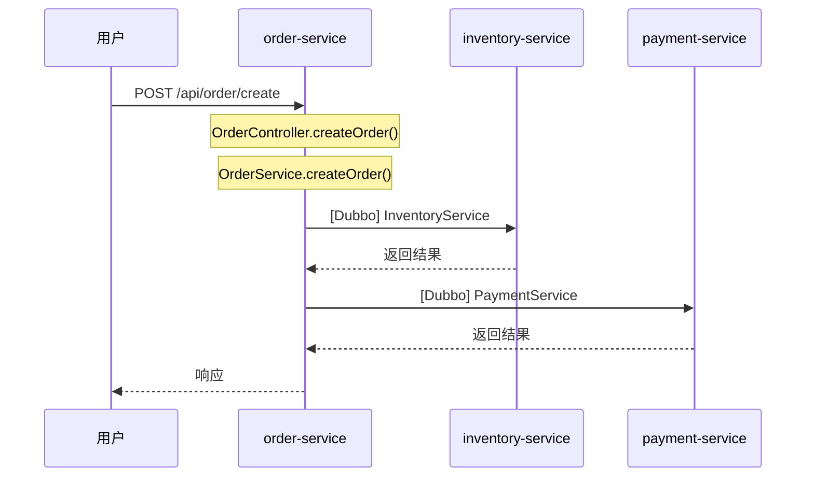

# 业务链路生成功能使用指南

## 功能概述

业务链路生成功能可以自动分析多个微服务仓库的调用关系，追踪业务流程，并生成可视化的Mermaid时序图。

## 已实现功能

### 1. 服务依赖分析
- 识别Dubbo服务依赖（@Reference/@DubboReference）
- 识别Feign服务依赖（@FeignClient）
- 构建服务依赖图和接口索引

### 2. 调用链路追踪
- 从入口点递归追踪方法调用
- 识别本地调用和远程调用（Dubbo/Feign）
- 循环检测，避免死循环
- 深度限制（默认5层，可配置）

### 3. Mermaid时序图生成
- 自动生成Mermaid sequenceDiagram
- 支持同步调用（->>）和返回（-->>）
- 支持本地方法调用（Note）
- 标记远程调用类型（[Dubbo]/[Feign]）

### 4. AI语义增强
- 使用Claude CLI分析业务流程
- 生成业务场景描述
- 异步执行，超时1小时

## API接口

### 1. 分析服务依赖

```bash
POST /api/v1/business-flow/dependencies

Request:
{
  "projectPaths": [
    "/path/to/order-service",
    "/path/to/inventory-service",
    "/path/to/payment-service"
  ]
}

Response:
{
  "services": {
    "order-service": {
      "serviceName": "order-service",
      "providedInterfaces": ["com.example.OrderService"],
      "requiredInterfaces": ["com.example.InventoryService"]
    }
  },
  "dependencies": [
    {
      "sourceService": "order-service",
      "targetService": "inventory-service",
      "interfaceName": "com.example.InventoryService",
      "type": "DUBBO"
    }
  ]
}
```

### 2. 生成业务流程

```bash
POST /api/v1/business-flow/generate

Request:
{
  "projectPaths": [
    "/path/to/order-service",
    "/path/to/inventory-service"
  ],
  "projectPath": "/path/to/order-service",
  "entryPoint": {
    "type": "HTTP",
    "path": "/api/order/create",
    "className": "com.example.OrderController",
    "methodName": "createOrder"
  },
  "maxDepth": 5
}

Response:
{
  "flowId": "uuid",
  "entryPoint": {...},
  "callChain": {
    "root": {
      "service": "order-service",
      "className": "com.example.OrderController",
      "method": "createOrder()",
      "type": "LOCAL",
      "children": [...]
    }
  },
  "mermaidDiagram": "sequenceDiagram\n    participant 用户\n    ...",
  "nodeCount": 15,
  "maxDepth": 3
}
```

### 3. 生成所有业务流程

```bash
POST /api/v1/business-flow/generate-all

Request:
{
  "projectPaths": ["/path/to/order-service"],
  "projectPath": "/path/to/order-service",
  "maxDepth": 5
}

Response: [
  {
    "flowId": "uuid1",
    "entryPoint": {...},
    "mermaidDiagram": "...",
    ...
  },
  {
    "flowId": "uuid2",
    "entryPoint": {...},
    "mermaidDiagram": "...",
    ...
  }
]
```

## 使用示例

### 示例1：分析订单服务的业务流程

```bash
curl -X POST http://localhost:18091/api/v1/business-flow/generate \
  -H "Content-Type: application/json" \
  -d '{
    "projectPaths": [
      "/data/koalawiki/git/order-service",
      "/data/koalawiki/git/inventory-service",
      "/data/koalawiki/git/payment-service"
    ],
    "projectPath": "/data/koalawiki/git/order-service",
    "entryPoint": {
      "type": "HTTP",
      "path": "/api/order/create",
      "className": "com.example.order.controller.OrderController",
      "methodName": "createOrder"
    },
    "maxDepth": 5
  }'
```

### 示例2：生成的Mermaid时序图



## 技术架构

### 核心组件

1. **ServiceDependencyAnalyzer** - 服务依赖分析器
   - 扫描多个项目
   - 识别@Reference/@DubboReference/@FeignClient
   - 构建服务依赖图

2. **BusinessFlowTracer** - 业务流程追踪器
   - 从入口点开始递归追踪
   - 识别本地调用和远程调用
   - 循环检测和深度限制

3. **MermaidGenerator** - Mermaid生成器
   - 生成sequenceDiagram DSL
   - 自动声明参与者
   - 生成调用步骤

4. **BusinessFlowSemanticService** - AI语义增强
   - 使用Claude CLI分析
   - 生成业务描述

### 数据模型

- `ServiceDependency` - 服务依赖关系
- `ServiceDependencyGraph` - 服务依赖图
- `CallChain` - 调用链
- `CallNode` - 调用节点
- `BusinessFlowResult` - 业务流程结果

## 配置说明

### 超时配置

```yaml
ai:
  timeout: 3600000  # 1小时（毫秒）
```

### 追踪深度

默认最大深度为5层，可通过API参数 `maxDepth` 调整。

## 限制和注意事项

1. **Java 8兼容** - 所有代码兼容Java 8
2. **深度限制** - 默认最多追踪5层调用，避免性能问题
3. **循环检测** - 自动检测循环调用，避免死循环
4. **接口匹配** - 依赖完整的包名匹配，简单类名可能匹配失败
5. **Claude CLI** - 需要本地安装Claude CLI工具

## 下一步计划

- [ ] 前端集成（Vue + Mermaid.js）
- [ ] 支持MQ异步调用追踪
- [ ] 支持RestTemplate调用识别
- [ ] 优化接口名解析（支持import分析）
- [ ] 添加缓存机制
- [ ] 支持增量分析

## 相关文档

- [技术方案设计](./DESIGN.md)
- [项目README](../../README.md)
